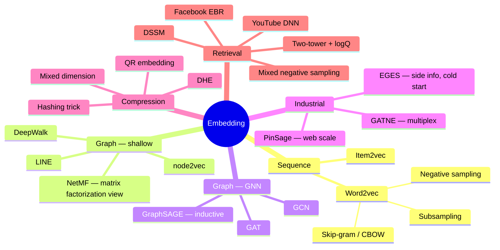

A map of the embedding literature in search, recommendation and advertising, organized the way I
learned it. Each branch is a family of ideas; the notes behind them go paper by paper.

### The one thing to remember

| Family | Core trick | Solves |
|---|---|---|
| Word2vec | negative sampling + subsampling | full softmax over a huge vocabulary is too slow |
| Shallow graph | random walks as sentences | no explicit objective for graph structure |
| GNN | learn an aggregation function | new nodes have no vector (cold start) |
| Compression | share rows / drop the table | embedding tables do not fit in memory |
| Two-tower | in-batch negatives + logQ correction | candidate set is the whole catalog |
