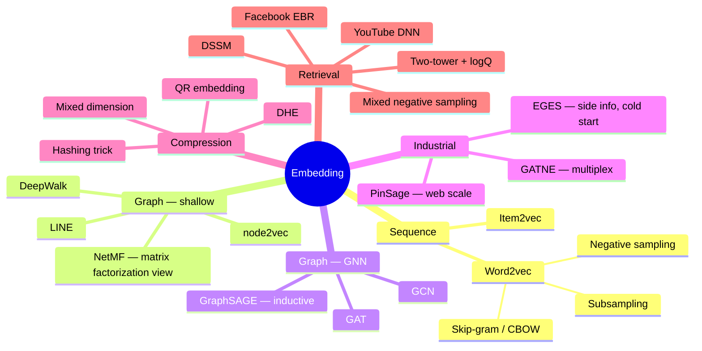

A map of the search / recommendation / advertising literature, organized the way I learned it.
Each branch is a family of ideas; the notes behind them go paper by paper.

> The diagrams below are mind maps — click a node's parent to collapse it.
{: .prompt-tip }

## Embedding

How items, users and queries become vectors.

### The one thing to remember

| Family | Core trick | Solves |
|---|---|---|
| Word2vec | negative sampling + subsampling | full softmax over a huge vocabulary is too slow |
| Shallow graph | random walks as sentences | no explicit objective for graph structure |
| GNN | learn an aggregation function | new nodes have no vector (cold start) |
| Compression | share rows / drop the table | embedding tables do not fit in memory |
| Two-tower | in-batch negatives + logQ correction | candidate set is the whole catalog |

<!-- TODO: add the remaining maps as the notes get written. -->

## Matching / Retrieval

TODO

## Ranking

TODO
